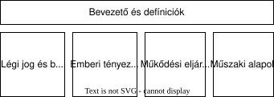
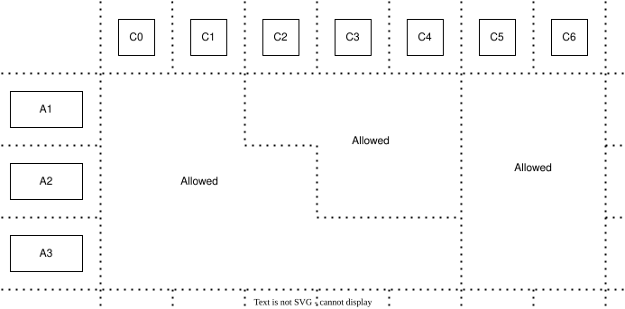
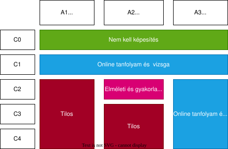
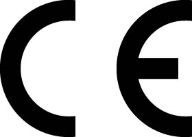
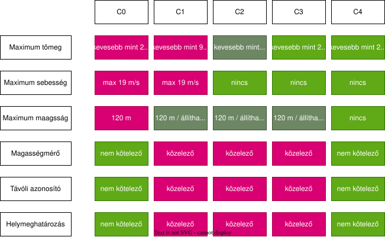
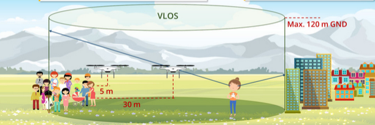
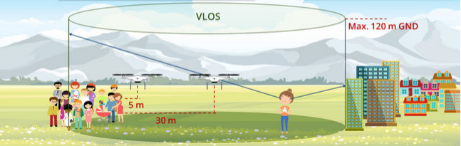
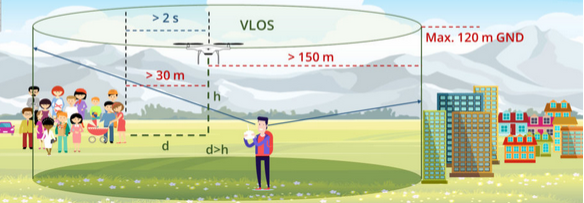
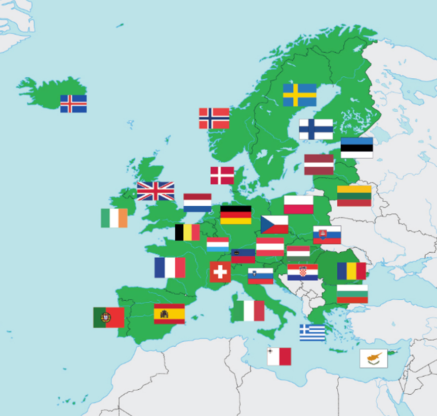

# Drón jogosítvány jegyzet

- [Bevezető](#bevezető)
- [Weboldalak](#weboldalak)
- [Tananyag](#tananyag)

## Bevezető

Ezt a jegyzetet saját magamnak készítettem a A1/A3 drón jogosítvány megszerzéséhez.

>Ez a jegyzet nem egy hivatalos tananyag, nem garantálja az vizsga teljesítését.

A jogosítványt az ausztriai légiforgalmi szolgálatnál (Astro Control) tettem le online, angol nyelven. Ezt ajánlom neked is, ha nincs kedved fizetni a vizsgáért.

## Weboldalak

Az [Astro Control Drone Space](https://dronespace.at) weboldala tök jól leír mindent.

- [Astro Control tananyag](https://online-kurs.dronespace.at/online-kurs/lehrmaterial/): ez csak németül elérhető, de egy böngésző neked lefordítja bármire
- [Astro Control gyakorló feladatok](https://online-kurs.dronespace.at/online-kurs/uebungsaufgaben/): a teszt megoldásához kiválasztható az angol nyelv

# Tananyag

A tananyag 5 részből áll

- [Bevező](#bevezető-1)
- [Légi jog és biztonság](#légi-jog-és-biztonság)
- [Emberi tényezők és korlátaik](#emberi-tényezők-és-korlátaik)
- [Üzemeltetési eljárások](#üzemeltetési-eljárások)
- [Műszaki alapok](#műszaki-alapok)

# Bevezető

Miért kell a drón jogosítvány? Mert exponenciálisan nő a drónok száma, nem csak speciális (katonai) esetekben. Erre kellett választ találnia az EASA-nak (európai repülésbiztonsági szervezet) és a nemzeti légiforgalmi irányítoknak.

Emellett nyilván nem elhanyagolhatóak egyéb tényezők, mint például a drónok keltette zaj, akár vizuális zaj (fel alá repkednek), vagy a magánszéfra (privacy) megsértése, például berepül a telkedre.

-> Ezekre a megoldás a szabályzás: képzés majd vizsga

Fontos: onanntól kezdve hogy felszálltál egy drónnal a légi közlekedés résztvevője vagy, így rád is vonatkoznak az aktuális szabályok.

## Definíciók

### Automata üzemmód

Olyan üzemmódok, amely során a drón egy automata műveletet hajt végre, de lehetőség van a manuális beavatkozásra. 

Például "return to home", automatic landing, stabilizálás.

### Autonóm üzemmód
Autonóm üzemmód során a drón teljesen önállóan cselekszik, nem feltétlen van lehetőség a beavatkozásra.

Az OPEN kategóriába ilyen drónok nem esnek.

### Érintett személy

Azok az emberek akik segítik a drón üzemelését. A felelősségi körök kiterjedhetnek 
- a légtér figyelésre (airspace observation)
- kommunikációra (communication)
- a fel és leszállási terület biztosítása (securing the take-off and landing site)

Fontos, hogy az érintett személyeket részletese utasításokkal lássuk el, illetve tisztázzuk velük a felelősségi köröket (ki mire figyel, mit csinál) egy kisebb megbeszélés során a felszállás előtt.

### BVLOS

BVLOS (“Beyond Visual Line Of Sight”) a vízuális látóhatáron túl (nem látod).

OPEN kategóriában nem engedélyezett

### Repülési magasságok

Több magasság is létezik.

#### AGL ("Above Ground Level")

Föld feletti magasság. Adott pontban értelmezhető. Egy hegyes terepen ez hamar elég bizarr tud lenni, pl. ha elszáll az ember egy szakadék mellett hirtelen felugrik a AGL magasság.

#### MSL ("Mean Sea Level")

Tengerszint feletti magasság. Ez egy általánosabb magasság adat (egyébként egy nyomásértéket szokott jelenteni). 

### FPV 

"First Person View": belső nézet. Repülés esetén azt jelenti, hogy a drónon egy kamera van elhelyeztve és a kezelő egy VR szeműveg segítségével látja, hogy mi történik a drónnal, merre halad. 

Az FPV VLOS-nak számít, lévén a drón egy direkt vizuális összeköttetésben áll az üzemelővel.

### Földrajzi zónák

A légtér felvan osztva több zónára, attól függően hogy a légiirányítási szolgálat engedélyezi, korlátozza, vagy megtiltja a drón használatot.

Csak ott lehet drónnal repkedni ahol nincs ideiglenesen korlátozva, vagy teljesen megtiltva. 

Pilótaként a te felelősséged, hogy a megfelelő zónában repülj, így naprakésznek kell lenni a zónákkal kapcsolatban. Ezek az információk közzé vannak téva a légiirányítási szolgálat által.

### Súly

Repüléstechnikában több tömeg is meg van határozva, viszont a legfontosabb a "maximális felszállási tömeg" (MTOM - Maximum Take-off Mass), ami magában foglalja az üzemanyagot, illetve a hasznos terhet (payload). Ezt a gyártó megadja minden drón esetén és a rendszer soha nem lépheti át ezt a tömeget.

### Tömeg (mint emberek)

Azok az emberek, akik annyira sűrűn állnak, hogy nem tudnak könnyedén és gyorsan arrébb mozdulni (egy kis utcában 20 ember is tömegnek számít, míg egy nagy mezőn akár 100 ember se).

Ennek az állapotnak a megítélése nehéz lehet nagyobb távolságból (vagy amúgy is, ki mennyire mozgékony), ezért legyünk mindig elővigyázatosak.

### Hasznos teher

Minden olyan dolog, ami nem szükséges ahhoz hogy műkődjön a drón. Motorok, akksi, propeller, váz, szükséges kommunikáció / vezérlő nem számít hasznos tehernek. Egyéb dolgok, mint pl. kamera, vagy egyébb opcionális dolgok viszont annak számítanak, attól függetlenül, hogy könnyen eltávolítható-e a drónról vagy nem.

### UAS ("Unmanned aerial system") / Drón

Az UAS kifejezés letakaraja magát a drónt, viszont mivel rendszer, ezért bele tartozik például az irányítás is.

### Nem tájékoztatott emberek/nem bevont emberek (Uninvolved persons)

Azok az emberek, akik nem használnak drónt, és/vagy nem tudnak a drónhasználat lépéseiről és szabályairól (egységsugarú ember). Az nem lényeges, hogy ki vannak-e téve közvetlen vagy közvetve a drón repülés hatásainak vagy nem. 

Nem bevont emberek esetén sokkal szigurúbb szabályok vonatkoznak, amelyekre mindig figyelemmel kell lenni pilótaként.

### VLOS ("Visual Line Of Sight”)

Vizuális látóhatár: látod közvetlenül a drónt. OPEN kategória esetén csak ilyen repülés engedélyezett.

A VLOS nem egy elméleti látóhatárt jelent, hanem gyakorlati látóhatárt, például ködben ez csak pár méter.

# Légi jog és biztonság

- [UAS kategóriák](#uas-kategóriák)
- [Repülés adminisztráció és alap szabályok](#repülés-adminisztráció-és-alap-szabályok)
- [Légterek és korlátozások](#légterek-és-korlátozások)
- [Biztonságos repülés és felelősségek](#biztonságos-repülés-és-felelősségek)
- [Biztonság, magánszféra, biztosítás (Securtiy, Privacy, Insurance)](#biztonság-magánszféra-biztosítás-securtiy-privacy-insurance)

## UAS kategóriák

Pilóta nélküli repülőgépnek (unmanned aerial vehicle - UAV) számít minden olyan repülőgép, amelyet nem egy a fedélzeten tartozkodó pilóta irányít. Ez jelentheti azt, hogy a drón önvezető (autónom), vagy egy távoli pilató vezérli a megfelelő távirányítással.

Lehetséges az az eset, hogy a pilóta nélküli repülőgépnek vannak utasai, ezeket pilóta nélküli rendszereknek (Unmanned Aircraft System - UAS) nevezzük.

### UAS osztályok

Az EASA szabályozása alá eső drónok három kategóriába vannak sorolva

- Nyitott (**OPEN**)
- Speciális (**SPECIFIC**)
- Regisztráció köteles (**CERTIFIED**)

Az EASA szabályozás alá nem eső drónok

- A beltéren üzemeltetett drónok (mini drón a nappaliban)
- Rendőrség, tűzoltóság, egyéb hivatalos szervek által használt drónok

#### Besorolás

Az **OPEN** kategóriába esik az a drón, ami

- Könnyebb mint 25 kg
- Nem repül tömeg felett
- Nem repül magasabban mint 120 méter (AGL - Above Ground Level - Föld feletti magasság)
- VLOS repülés
- Se veszélyes anyagokat, se embereket nem szállít

A **SPECIFIC** kategóriába esik az a drón, amire igaz bármelyik az alábbiak közül:

- Nehezebb mint 25 kg
- 120 méter AGL feletti agasságban vagy speciális légtérben történő repülés
- BVLOS repülés

A **CERTIFIED** ategóriába esik az a drón, amire igaz bármelyik az alábbiak közül:

- Tömeg feletti repülés
- Veszélyes anyagokat szállít
- Embereket szállít

### Open kategória

Ez a kategória a legkevésbé szabályozott, de a név ellenére léteznek itt is szabályok. 

Egy OPEN kategóriájú drón reptetése **általában** nem igényel előzetes bejelentést és jóváhagyást se. A drónnal lehet repülni, ha 
- a drón megfelel a műszaki feltételeknek
- a pilóta megfelelel az előírásoknak
- a pilóta a megfelelő képesítéssel rendelkezik
- egyéb segítők be vannak jelentve (ha vannak)

Az OPEN kategórián belül a repülések különböző repülési kategóriákba vannak sorolva aszerint, hogy milyen terep felett szeretnénk repülni. Ezek a kategóriák az A1, A2 és A3.

A drón a műszaki paraméterei szerint is alkategóriákba van sorolva, ezek a C0, C1, C2, C3 és C3.

A repülés okozta kockázatok több tényezőn alapulnak, a fő tényező nyilván a drón tömege, illetve, hogy merre és mire használnánk (kert felett az alma fa felett vagy tömeg felett). Egy kis drón kisebb sérülést és kárt okoz, így emberekhez közelebb is használható, amíg egy nagyobb, nehezebb drón akár meg is ölhet valakit ha véletlen lezúhan, ezért a repülési szabályok a repülési kategória és a drón alkategória függők, egy mátrixot alkotva.

Ha adott milyen drónnal repülnél --> meg van szabva, hogy milyen fajta repülést végezhetsz.
Ha adott, hogy milyen repülést végeznél --> meg van szabva, milyen drónokkal teheted

Adott repülés típus esetén csak adott képesítésű személy repülhet adott típusú drónkkal. A típusokról a következőkben lesz szó.

### Műszaki kategóriák

Ahhoz hogy egy terméket el lehessen adni az EU-ban egy "CE" jelöléssel kell rendelkezni, amely azt mutatja meg, hogy a termék megfelel az európai szabványoknak. A CE mellett a drónoknak rendelkeznie kell egy osztály jelölő jellel, amely megmutatja, hogy a C0 - C4 kategóriák közül melyikbe tartozik. Ezek nélkül nem repülhet egy drón.

Az hogy milyen drónt vegyünk nagyban függ a felhasználási feltételtől (használati mátrix), például hogy közel akarunk-e repülni emberekhez vagy nem.

- C0 kategória: nem kizárható, hogy nem tájékoztatott emberek (Uninvolved person) felett is elrepülnénk.
- C1 kategória: biztos, hogy nem fogunk nem tájékoztatott emberek (uninvolved person) felett repülni. 
- C2 kategória: nem tájékoztatott emberektől (uninvolved person) horizontálisan 30 méterre (lassú repülés módban 5 méterre) történő repülés. A távolságnak mindig megfigyelhetőnek (observable) kell lennie.
- C3 és C4 esetén nem lehet a közelben nem tájékoztatott ember, emellett 150 méterre kell repülni ipari létesítményektől, épületektől és infrastruktúrűtól.

Az EASA meghatároz még C5 és C6 kategóriákat is, de ezek nem számítanak az OPEN kategóriában.

#### Sebesség korlátok

C0 és C1 kategória esetén maximális sebesség van meghatározva, ami 19 m/s. Ezt a sebességkorlátot azért számolták ki, hogy ezen kategóriájú drónok egy véletlen ütközés esetén ne okozzanak súlyos sérüléseket még.

C2, C3 és C4 kategóriájú drónok esetén nincs sebességkorlátozás, mert ezen drónok annyival nehezebbek, hogy akármilyen ütközés súlyos sérülést tudna okozni.

Ezen okokból kifolyólag csak C0 és C1 kategóriájú drónok reptethetőek emberek között.

#### Magasság

A C0 kategóriájú drónokba be van építve egy funkció ami megakadályozza, hogy 120 méternél magasabbra szálljanak fel. Ez nem zárja ki teljesen a légtér sértés kockázatát, viszot segít megakadályozni a magasságkorlát megszegését.

A C1, C2 és C3 drónokban állítható ez a beállítás, például egy model-repülőgép légtérben vagy ha erre speciális engedélyt kap a pilóta.

Viszont a beépített maximális korlát miatt a C1, C2 és C3 típusú drónokat el kell látni egy magasságmérővel, amelyet a pilóta folyamatosan figyelhet. Meg kell említeni, hogy a magasságmérőnek van egy pontatlansága, illetve a felszín egyenetlensége miatt megeshet, hogy a magasságmérő egy 120 méter alatti értéket mutat, amíg a drón már 120 méter felett repül

#### Azonosítás

A C1, C2 és C3 drónoknak egy távoli azonosítást lehetővé tevő funkcióval, ami lehetővé teszi, hogy a földről meg lehessen határozni, hogy milyen drón repül a légtérben, hol található a pilóta, illetve ki a pilóta. 

Az alábbi adatokat köldi el:
- pilóta datai
- azonosító szám
- drón pozíció
- pilóta pozíció
- sebesség
- magasság

Ezért tartsd észben, hogy nem névtelenül repülsz, amikor megnézel vagy lefilemzel egy területet kamerával.

#### Helymeghatározás

Ha a drón fel van szerelve helymeghatározással, akkor automatikusan összeveti a helyzetét a különböző hivatali szervek által megadott légterekkel. Ha a légtér tiltott terület, akkor erről értesítést küld a felhasználónak.

A virtuális kerítés (geo-fencing) funkció annyival szigorúbb, hogy nem csak értesítést küld a tiltott légtérről, hanem megakadályozza, hogy egy ilyen területre berepüljön a drón

C1, C2 és C3 drónok számára kötelező a helymeghatározás, viszont a virtuális kerítés nem kötelező (viszont be lehet építeni, így ne lepődjünk meg).

Összefoglalva az alábbi táblázatban látható

Láthatjuk, hogy C4 esetén megengedőbbek a szabályok. Ez azért van, mert a C4 egy gyújtő kategória a régebbi drónok esetére, például ha van egy 3 kg nehéz drónod, ami a súlya alapján C2 kategória lenne, így jogósult lenne az emberek közeli repülésre (A2), de nincsen helymeghatározója, így C4 kategóriába kerül, amivel csak A3 repülésre lehet használni.

### Repülés kategóriák

#### A1 - emberek felett

Ennek a kategóriának van a legkevesebb szabálya. Lehetőség van akár sűrű embertömeg felett is repülni (de nem tömeg felett! Igen, ez egy kicsit megtévesztő, gondolj arra hogy tüntetés vs egy focimeccs). 

C0 és C1 kategóriájú drón végezhet ilyen repülést. 

C1 drón esetén a pilótának meg kell vizsgálni a területet ahol a repülni fog és meg kell győzödnie, hogy nem bevont / tájékoztatott ember (uninvolved person) felett nem fog repülni.

Ezen vizsgálat során az alábbiakat kell figyelemmbe venni és értékelni
- A szituáció a földön (útak, járdák, bicikli út, merre vannak emberek, etc.)
- Lehetőségek a terület biztosítására
- a napszak

Ha véletlen egy járókelő felett repülönk, törekedjünk, hogy minél kevesebb időt repüljünk felette. 

Minden esetben a pilóta látómezején belül kell lennie a drónnak, és nem repülhet magasabbra mint 120 méter.

C0 kategóriájú drónnal, illetve házi építésű, 250 grammnál könnyebb drón esetén megengedett az emberek feletti repülés extrém óvatossággal. Ennek ellenére kerüljük ezt, ha tudjuk.

C2, C3, C4 típusó drónokkal tilos ilyen módon repülni.

#### A2 - emberekhez közel

##### C2

Ez a kategória van a leginkább szabályozva, lévén ilyen repülés folyamán van a legnagyobb kockázat. Relatív nehéz ( < 4 kg) drónok repülhetnek emberekhez közel.

Ebben a kategóriában ha C2 típusú drónnal akarunk repülni, akkor egy szigorúbb képzést is el kell végezni.

Mivel a sérülés esélye nő a drón sebességével, ezért **a biztonsági távolság sebességfüggő**. 

- lassú repülésben 5 méter
- egyébként 30 m

Lassú repülésnek az számit, ha a drón sebessége 3 m/s (10 km/h) sebességnél kisebb, vagy a drón egy ballonnak vagy léghajónak lett tervezve.

Ennél nagyobb biztonsági távolság kötelező, ha nem ideálisak a környezeti feltételek (szél, alacsony akksi töltöttség), vagy ha különböző akadályok (fák) ezt indokolják.

A maximális magasság ebben az esetben is 120 méter és a drónnak a pilóta látómezejében kell hogy legyen (VLOS)

A2 vizsga az alábbi mód tehető:
- online képzés és vizsga
- gyakorlati képzés
- gyakorlati vizsga

##### C0 és C1 

Ugyan úgy reptethető, mint A1

##### C3 és C4

Ezek a kategóriájú drónok nem repülhetnek emberekhez közel se

#### A3 - emberektől távol

Ebben a kategóriában reptethetőek a legnehezebb drónok ( < 25 kg). Annak ellenére, hogy a pilótának nem kell szigorúbb feltételeknek megfelelnie, mégis itt vannak a legnagyobb biztonsági távolságok alkalmazva bármitől, aminek a drón nekiütközhet (épületek, infrastruktúra).

A minimum távolság lakó és ipari épületektől, pihenő övezetektől és infrastruktúrától minimum **150 méter**.

Kötelező biztosítani, hogy nem tájékoztatott / bevont ember (uninvolved person) nem lehet jelen a repülés során a területen.

Ha nem lehetséges a biztonságos távolság tartása ezen járókelőktől, azonnal le kell szállni.

A biztonsági távolságra az alábbi szabályok vonatkoznak
- több mint 30 méter
-  1:1 szabály, azaz 1 m távolság esetén max 1 méter magasság, 20 méter távolság esetén max 20 méter, 120 méter távolság esetán 120 méter magasság
- minimum 2 másodpercnyi utazási távolság, amely körülbelül a reakció időnek felel meg

Ezek mellé a 120 méteres magassági korlátozás is vonatkozik a drónra, amely a pilóta látómezójében kell hogy történjen (VLOS)

## Adminisztráció és alap szabályok

Ebben a fejezetben a repülési szabályzó szervek felépülésével és egymás alá és fölé rendeltségével, illetve a repülséhez szükséges képesítésekkel foglalkozunk.

### EASA

Az Európai Repülésbiztonsági Ügynökség (European Aviation Safety Agency - EASA) egy EU-s hivatal amelynek a fő feladata a repüléshez kapcsolódó szabályok és törvények kezelése, létrehozása, stb. Az egész civilizált európa a tagja. (EU + UK, Norvégia, stb stb)

Az EASA a törvény tervezeteket nyilvánossá teszi. Ezeket a nemzeti légügyi hatóságokhoz, illetve légügyi képviselők tudják kommentelni, illetve javaslatokat tenni.

Ezek után az EASA a tervezetet az EU parlament és az EU tanács elő küldi, amelyek ha elfogadják azonnal az összes EU tagállamban validdá teszik.

A nemzeti eltérések nem lehetségesek, csak pár dologban hagy az EASA teret a nemezti szabályozásnak, mint például drónok esetén a különböző légterek kijelőlése, vagy a repülésért felelős szerv kijelőlése.

EU-n kivüli országok számára idő lehet mire nemzeti törvénnyé válik egy új EASA törvény.

EASA tervezet -> Véleményezés -> Végső tervezet -> EP és EU tanács -> EU törvény -> nemzeti törvény

### Nemzeti hatóság

Általában az EASA tagállamok rendelkeznek egy nemzeti légügyi hatósággal (Aviation Authority), amely felügyeli a repüléshez kötödő aktivitásokat a megfelelően képzett személyzetével. Felügyeli a pilota nélküli és hagyományos repülést, a piloták jogi és szakmai állapotát, a különböző kiszolgálokat, karbantartó cégeket és gyártókat.

Egyes országokban több repülésügyi hatóság is létezhez, amelyek között a felelősségi körök szét vannak osztva.

#### Illetékes hatóság

Drónpilótaként fontos tudni, hogy pontosan melyik illetékes hatóság (competent aviation authority) feleős a drónokért. Mivel egész európán belül repülhetünk (EASA), így lehet hogy több különböző hatóság is felelős a drónokért (osztrák, magyar, szlovák ha mondjuk jársz ebben a 3 országban).

Az illetékes hatóság az, amely abban az országban felelős a drónokért amelyben a bejelentett lakcímed van. Ez a hatóság felelős
- drón regisztrációs rendszer fenntartásáért
- online képzés és vizsgáztatás fenntartásáért (magyar hatóság lol)
- drónok felügyelete az ország területe felett

### Jogi alapok

A következő EU-s szabályok fontosak drónpilóták számára

#### EASA Basic Regulation - Basic Regulation EU 2018/1139

Ez tartalmazza az alapvető európai repülési szabályokat, például hogy
- a pilotóknak és üzemeltetőknek kötelező tudniuk az aktuális szabályzásról
- drónokat úgy kell tervezni, hogy minimalizálják a risk -et és ne veszélyeztessenek embereket
- drón pilótáknak rendelkezniük kell bizonyos kompetenciákkal

#### Delegated Regulation on UAS EU 2019/945

Műszaki követelmények drónok számára

#### UAS Implementing Regulation EU 2019/947

Ebben van részletezve a drón üzemeltetés részletes szabályai, például a különböző alkategóriák.

#### EASA Accepted verification procedures and guidance

Az EASA közzé tesz kiadványokat, amelyek segítenek értelmezni és alkalmazni az EU-s törvényeket, illetve részletesebben kifejti a törvényben szereplő kifejezéseket.

#### Nemzeti törvények

A nemzeti törvények csak arra szükségesek hogy az EU-s törvnyeket magukra szablyak az ő körülményeiknek megfelelően.

Például az EU szabályzás előírja, hogy a légteret fel kell osztani zónákra, amelyekben tiltott vagy engedélyezett a drón repülés. Ez a a nemzeti hatóságok feladata, hogy meghatározzák, mely területeket milyen besorolást kapnak (így alkalmazván az EU-s törvényt)

A nemzeti hatóságok általában interneten és applikációkon keresztül publikálnak információkat.

### Kvalifikáltság

A drón pilótáknak meg kell felelni pár feltételnek ahhoz hogy repülést hajthassanak végre, amelyek

- minimum életkor
- megfelelő tudás

#### Minimum életkor

Az OPEN kategóriában a minimum korhatár pilóták számára 16 év. Ezt az EU-s tagállamok egyéni hatáskörben lejebb vihetik 4 évvel (12 év életkorig). 

Emellé a 12 - 16 év közötti pilóták számára egyéb szabályok is meghatározhatok.

A minimum életkor szabályt nem kell használni, ha
- ha egy C0 kategóriájú drón repül A1 kategóriában
- egy kvalifikált drón pilóta direkt felügyeli a fiatal pilótát

#### Megfelelő tudás

Az alkategóriától függően egy drónpilótának sok követelménynek meg kell felelnie. Hogy ehhez a megfelelő tudást megszerezze, az összes drón pilotának el kell végeznie egy online elméleti képzést és át kell mennie az ehhez tartozó online teszten.

Az egyetlen kivétel a C0 kategória, amihez nem kell semmilyen képesítés sem.

Az online kurzus az alábbi témákat érinti:
- repülés biztonság
- légterek és zónák
- repülés szabályzás
- emberi tényezők
- Üzemeltetési eljárások
- UAS műszaki témák
- Adatvédelem
- Biztosítás
- Safety

Az online teszt elvágzáse után megkapjuk a certificate -et, ami 5 évre szól.

#### A2

Gyakorlati önképzés csak a C2 drónok A2 -es esetén szükséges, mivel ebben az esetben relatív nagy drónokkal repülünk relatív közel emberekhez, ezért először a pilótának a megfelelő gyakorlattal kell rendelkezni repülés során.

Ezt olyan területen kell megtenni, ahol nincsenek nem tájékoztatott emberek (uninvolved person), azaz A3 repülés.

Az önképzés során figyelj arra, hogy
- minimum 5x repültél
- ismerd meg a területeket és a határokat
- ismerd meg az összes control mode -ot
- ismerkedj emg a vezérlés összes elemével, összes gomb, interfész
- próbáld ki a vészhelyzeteket (return function, összeköttetés megszakadás)

Ezek után önbevallást kell tennie arról, hogy sikeresen elvégezte a gyakorlati képzést és hogy megbizhatóan tudja irányítani a drónt.

Ezen felül el kell végezni egy A2 elméleti vizsgát is, amelyet az illetékes hatóság szervez meg.

Ez elvégzése után megszerezzük az A2 jogósítványt, amelynek az érvényessége a vizsgáztató hatóság általá van meghatározva.

### Drón regisztráció

A drónok regiszrtációja elsődlegesen nem safety okból történik, hanem adatvédelmi okból. Relatív könnyű megsérteni emberek magánéletét és személyes terét egy drónnal, ezért a regisztráció kötelesség nem feltétlen a drón súlya alapján történik, hanem az adatgyűjtés potenciálja szerint.

Ha a drónod az alábbi feltételek közül egynek is megfelel akkor regisztrálnod kell a drónodat

- A maximális felszállási súly több mint 250 gramm (C1 - C4)
- Az ütközési energiája több mint 80 J
- Fel van szerelve bármilyen szenzorral ami képes adatgyűjtése, pl. kamera, videókamera, mikrofón

Mentesülsz a regiszrtráció alól ha a drón a EU Toys Directive (Directive 2009/48/EC of the European Parliament) alá esik.

A regisztráció az illetékes hatóság által történik

#### Ütközési energia

Az az energia, amivel a drón becsapodik. Minél nagyobb, annál nagyobb az esély a sérülésre.

Egy 25 méter magasan 19 m/s sebességgel repülő C0 kategóriájú drón zuhanás során képes egy 110 J ütközési energiára, ami bőven a regisztráció limit felett van.

## Légterek és korlátozások

Alapvetően drón pilótaként nem kell ismerni azt a komplex szabályzási rendszert ami érvényes a légterekre, mert csak egy nagyon kis részét használjuk a legalsó légtér szeletnek, viszont segít megérteni, hogy a minket érintő zónák, tiltások hogyan alakulnak ki.

### Légiforgalmi térkép

Minden országnak kötelező kiadni egy térképet, amely tartalamzza a repüléssel kapcsolatos adatokat és a légiforgalmat. Ennek az érvényessége általában 1 év, évenkénti újraértékelés miatt.

Ezek a térképek elérhetőek online, adott esetben ingyen is

[https://terkep.legter.hu](https://terkep.legter.hu)

A térkép szabványosított a Nemzetközi Polgári Repülési Szervezet (International Civil Aviation Organisation, the ICAO) által.

### Légtér

Alapesetben csak akkor van egy terület egy zónába sorolva, ha szükséges biztonsági szeompontból. Ezen felül a zónán belül a légtér magasság szerint még zónákra van osztva. Ezek a zónák metszhetik is emiatt egymást (egy 7 km feletti zóna simán átnyulhat egy olyan zóna felett, ami csak 3 km magasságig él.)

Mivel hatalmas a légi közlekedés, illetve egész európa be van borítva különböző zónákkal, ezért egy bizonyos magasság felett kontrollálva van a légi közlekedés (légi irányyítók hello).

Ez drónokra általában nem vonatkozik, lévén alacsonyan repülünk.

Az alap szabály: a légtér korlátozás néküli, amig nem szükséges a biztonság garantálása érdekében (pl. repülőtér)

### Speciális légterek

Ezen légterek nem csak a hagyományos repülőgépek számára, hanem a drónokra is vonatkoznak, lévén ezek felszíntől kezdődő légterek.
- kontroll zónák
- veszélyes, korlázotott és tiltott zónák
- természetvédelmi területek
- katonai alacsony repülés területek

#### Kontroll zónák

Ezek általában repülőterek környékén találhatóak. Ezek általában a személyszállítás biztosítása miatt lettek kijelölve, lévén le és felszállás során simán keresztezni tudná egy drón a repülő útját.

Tilos drónnal ilyen légtérben tartozkodni.

#### Tiltott zónok

Általában katonai gyakorlóterületek, természetvédelmi területek, kritikus infrastruktúrák környékén találhatóak.

#### Természetvédelmi terület

Kis repülő dolgok menekülési ösztönt váltanak ki a madarakból (főleg a vadon élőkből), amely például egy téli időszakban a madár pusztulását is okozhatja.

Az ő védelműk érdekében tiltott nemzeti parkok és természetvédelmi területeken drónnal repülni.

#### Katonai alacsony repülés

Vannak területek, amelyek ki vannak jelölve arra, hogy a honvédség alacsony magasságú repülést gyakoroljon a gépeikkel. Mivel ilyen területen egy random drón komoly veszélyt jelenthet, ezért kerülendő ezek a területek.

### Kisebb repterek

Kisebb repterek környékén nem szoktak felállítani kontroll zónát, ennek ellenére ezen repterek forgalma folyamatosan növekszik. Ezen kis gépek akár több percet is alacsony magasságban tölthetnek leszállás közben.

Ennek megfelelően, ha nincs véletlen kontrollzóna meghatározva a reptér körül, a lehető legnagyobb figyelemmel repülj drónnal ilyen kis repterek környékén, ha lehet, inkább kerüld el.

Mindig ellenőrizd, hogy nincs-e egy kontroll zóna a repülőtér környékén.

### Kórházak

A legtöbb kórház rendelkezik mentőhelikopter leszállóval. Ha nincsnek kontroll zóna kijelölve a kórház körül, akkor is figyelemmel repülj. 

Mindig ellenőrizd a légteret, hogy nincs-e egy kontroll zóna vagy tiltott zóna a kórház környékén.

### Drón zónák

Az EU szabályok egy könnyítést írnak elő a drónok számára az egész EU területén, amely szerint minden EU tagállam be kell sorolja a légterét különböző geo-zónákba, ahol a drón repülés megengedett, tiltott, vagy különböző feltételekhez kötött.

Ezekről a zónákról az információnak könnyen elérhetőnek kell lennie és könnyen érhetőnek kell lennie.

[https://mydronespace.hu/](https://mydronespace.hu/)

Bármelyik EU-s tagállam meghatározhat geo-zónáz, ahol a drón repülés
- tiltott
- engedélyköteles
- feltételekhez kötött
- általános követelmények kellenek

Az összes többi helyen, ami nincs zónába sorolva, az általános OPEN kategóriára vonatkozó szabályok vonatkoznak, azaz lehet repülni.

### Felszíni korlátozások

A légtér korlátózások mellé társulnak különböző felszíni korlátozások.

Például tömeg felett tilos repülni. Ez ellen nincs kivétel az OPEN kategóriában. Oké, és mi számít tömegnek.

Pontos defíniciója nincs a tömegnek, inkább egy leírás, hogy az a tömeg, ahol az ember nem tud szabadon mozogni, hogy például elkerüljön egy kontrollálatlan drónt.

Van pár példa is, mint
- nagyobb sport rendezvény, kulturális, vallási és politikai rendezvény
- strandok, parkok egy zsúfolt napon
- bevásároló utcák nyitási időben
- sí pályák

Emellett tilos repülni olyan terület felett, ahol vészhelyzet van. A rendvédelmi szervek (rendőrök, tűzoltók, mentők) gyakran használnak drónokat. A többi drón kitiltása biztossá teszi, hogy a máveleti terület feletti légtér üres, és egy mentő helikopter biztonságosan le tud szállni.

Repülés csak az eljáró szervek engedélyével lehetséges ilyen esetben.

## Biztonságos repülés és felelősségek

### Felelősségek

A drón pilótát ugyan olyan felelősség terheli mint egy normál pilótát. Ugyan azt a légteret használják így úgyan úgy felelősek azoknak az életéért akik egy másik repülőgépen utaznik ha a saját repülésük veszélyezteti őket.

A felelősség egy drón repülésért fel van osztva a drón üzemeltetője és a drón pilóta között.

A drón üzemeltetője az a jogi vagy természetes személy, aki üzemeltet vagy üzemeltetni szándékozik egy drónt. A legtöbb esetben, kifejezetten a privát szférában (privát --> mint emberek), az üzemeltető egy és ugyan az mint a drón pilóta. Viszont ez nem feltétlen igaz minden, például egy film studió az üzemeltető, birtokólhat drónokat, amig egy munkavállaló aki ténylegesen kezeli.

A drón pilóta aki éppen vezérli a drónt.

A drón pilóta kötelességei a felszállás előtt:
- meggyőződni arról, hogy rendelkezik-e a megfelelő képesítéssel a repüléshez
- információt szerezni a repülés során érintett légterektől
- ellenőriznie kell a környezetet, ellenőriznie kell, hogy vannak-e akadályok, illetve hogy érint-e nem tájékoztatott embert (uninvolved person)
- ellenőriznie kell, hogy a drón biztonséges és megfelel az üzemeltetési feltételeknek
- ellenőriznie kell a vezérlést
- ellenőriznie kell, hogy a távazonósítás műkődik-e megfelelően, ha szükséges
- ellenőriznie kell, hogy a maximális felszállási súlyt nem haladja-e meg

A drón pilóta kötelességei a repülés során:
- a drónt VLOS-ban (látótávolságon belül) kell tartania
- monitoroznia kell a közeli légteret, illetve kerülnie kell minden olyan kockázatot ami ütközéshez vezethet a másik drónnal vagy más repülővel
- azonnal le kell állítania a repülést ha a repülés kockázatot jelent bármilyen más légijárműre, állatra, környezetre, vagy a földön található dolgokra
- figyelni a geozónákra
- a drónt a gyártó ajánlásainak megfelelően kell üzemeltetni, tekintettel a megszorításokra és limitációkra
- be kell tartania az érvénybelévő jogszabályokat és követelményeket

A hatályos jogszabályok és elvárások megsértése az az állam által van bűntetve, ahol ez a jogsértés megesik

### Jó pilóta ("good airmanship")

A jó pilótaságnak vagy egy kifejezése az angolban "good airmanship". Ez:

---
The (distant) pilot / the (far)pilot is
 - familiar with the principles of aerodynamics,
 - possesses the ability to control the aircraft competently and accurately, both on the ground and in the air, and
 - has good judgment that guarantees safe and efficient operation."
---

Magyarul: (bocs a szar fordításért :D)

---
A jó pilóta az a pilóta, aki
- tisztában van az aerodinamika alapjaival
- képes a légijárművet megfelelően kezelni mind a földön mind a levegőben
- és jó ítélőképessége van ami garantálja a biztonságos és hatékony repülést
---

"Good airmanship" teszi a pilótát jó pilótává. Annak ellenére, hogy egy drón veszélytelennek tűnik, mégis nagy gondot tud okozni, gondoljunk például emberekre a földön, vagy más légijárművekre a légtérben.

A jó pilóta feladata hogy felismerje és minimalizálja a kockázatot amennyire lehetséges.

### Kockázatok

Hogy felismerjük és kezeljük a kockázatokat a drónrepülés során, különbséget kell tennünk földi kockázatok és a légi kockázatok.

A lehetséges veszély források lehetnek:
- Ütközés más légijárművel
- Majdnem-ütközés
- Látótávolság elvesztése
- Rádiós kapcsolat elvesztése
- Energiatároló lemerülése
- Drón használata illegális cselekményhez (cigi csempészek hello)
- Reptér műkődésének megzavarása
- Kontrollálatlan elrepülés
- Adatszivárgás
- Privát széfra megsértése
- Akkumulátor tűz
- Ingatlan rongálás
- Nyugalom megzavarása
- Személyi sérülés
- És még sok minden....

A fentebbeknek felsorolt források lehetnek légiek, földiek, vagy mindkettő

### Döntéshozás

Hogyha követed a "good airmanship" elveit és felismered a drón károkozó képességéet, ezek a döntéshozás támogató elvek tudnak segíteni a repülés során.

- Minden vakmerő viselkedés kerülendő
- Minden kockázat kerülendő
- Ha egy kis bizonytalanság is van valakinek a képességeiben, akkor elősször egy biztonságos helyen gyakoroljatok
- Folyamatosan nézd az időjárás jelentést, és kétes időjárás esetén halaszd el a repülést
- Folyamatosan figyeld a repülés közben a környezetet

### Légi KRESZ

A utcai közlekedéshez hasonlóan a légi közlekedésnek is vannak szabályai. Például, kinek van elsőbbsége?

Az elsőbbségi szabályok fontosak és egyszerűek:

- Embert szállító repülőknek mindig elsőbbsége van
- Sose repülj vakmerően közel más repülőgépekhez, hogy ne legyen ütközési kockázat
- Ha egy repülőgépnek láthatóan problémája van, elsőbbsége van
- Leszálló repülőknek elsőbbsége van felszálló repülőkkel szemben

Emellé, nagyon fontos hogy a drón piloták figyelemmel legyenek a maximum magasságra vonazkozó limitációra, illetve hogy emberrel történő repülők ne essenek a megengedett minimum magasságuk alá. Ez az egyetlen mód arra, hogy a két fajta repülést elszeparáljuk egymástól annyira amennyire lehet.

Rendes repülőgép pilóták számára szinte lehetetlen a drónok észlelése, mert el vannak foglalva a navigációval, rádiózással, checklistákkal, és más repülőkre való figyeléssel. Egy kis drón felismerése pl. 200 km/h -val haladó repülőből elég nehéz. Kifejezetten kritikus a felszállás és a leszállás, mert a minimum repülési magasság alatt vannak ilyenkor a repülők.

Ha egy másik repülő (normál vagy drón) jelen meg a légtérben hirtelen, a repülést fel kell függeszteni biztonságosan olyan gyorsan amilyen gyorsan lehet, és addig nem lehet folytatni amig az ütközés kockázata el nem múlt.

> Ezen a ponton engedtem el és generáltam ki a jegyzet nagy részét Mistral -lal. Igazából nem tudom hogy add-e a tanuláshoz az hozzá, hogy kigépelek mindent, már most 33 ezer karakternél tart és ez kb a negyede......

### VLOS (Visual Line of Sight – Látómezőn belüli üzemeltetés)
- **Definíció**: A **VLOS** (angol rövidítés) azt jelenti, hogy a drón **következetes látómezőn belül** üzemel, a távvezérlő pilóta **technikai eszközök nélkül** folyamatosan látja a drónt.
  - **Cél**: Ütközés elkerülése más légijárművekkel, emberekkel vagy akadályokkal.
  - **Időpont**: Nappali vagy éjszakai üzemeltetés is lehetséges (pl. fények segítségével).
  - **Kivétel**: **BVLOS** (Beyond Visual Line of Sight) – **tilos** a nyílt kategóriában.

- **C0/C1 osztályú drónok "Follow-Me" módja**:
  - A drón **automatikusan követi** a pilótát (pl. felvétel készítése céljából).
  - **Maximális távolság**: 50 méter (a szoftver automatikusan ellenőrzi).
  - **50 méter feletti távolság tilos**.

### FPV (First Person View – Első személyű nézet)
- **Leírás**: A pilóta a drón **kameráján keresztül** látja a környezetét (pl. VR-szemüveg vagy monitor segítségével).
- **Feltételek**:
  1. **Második, kvalifikált megfigyelő** szükséges, aki:
     - **Felelős** a légtér és környezet monitorozásáért.
     - **Közvetlenül** a pilóta mellett áll, és **folyamatosan látja** a drónt.
     - **Hatékony kommunikáció** a pilótával (pl. hangjelzések, rádió).
  2. A **távvezérlő pilóta felelőssége** marad a repülésért.
- **Cél**: Biztonságos repülés biztosítása, ütközés elkerülése.

### Veszélyes áruk szállítása
- **Tilos** a nyílt kategóriában:
  - **Veszélyes áruk** vagy **veszélyes anyagok** szállítása.
  - **Dobálás** (bármilyen tárgy, függetlenül attól, hogy veszélyes-e).
- **Kivétel**: Csak a **tüzelőanyag** vagy **energiaforrás** (pl. akkumulátor) engedélyezett.

#### Mi számít veszélyes árunak?
- **Robbanóanyagok**
- **Gázok**
- **Gyúlékony folyadékok/szilárd anyagok**
- **Oxidáló anyagok** (pl. gyújtóanyagok, szerves peroxidok)
- **Mérgező/fertőző anyagok**
- **Radioaktív anyagok**
- **Maró anyagok**

### Baleset- és incidensjelentés
- **Cél**: Jövőbeli balesetek megelőzése (nem büntetés kiszabása).
- **Kötelező jelenteni**, ha:
  - **Súlyos sérülés** vagy **halál** történt drón miatt.
  - **Majdnem ütközés** manőverezhető légijárművel.
- **Jelentési mód**:
  - **Németország**: [Szövetségi Légibaleset-vizsgáló Hivatal (BFU)](https://onl-meldung.bfu-web.de/onlmeldung) (ingyenes, online űrlap).
  - **Ausztria**: [Austro Control](https://www.austrocontrol.at/occ) (ingyenes, online űrlap).
- **Fontos**: A jelentés **nem vonható be büntetésre** – kizárólag a biztonság javítása a cél.

## Biztonság, magánszféra, biztosítás (Securtiy, Privacy, Insurance)

### Biztonság vs. Védettség (Security vs. Safety)

#### **Fogalmak magyarázata**
- **Security (Védettség)**: Védelem **szándékos** károkozás ellen, például:
  - Terrorizmus
  - Szándékos bűncselekmények
  - Drónok **bűnügyi célú** visszaélése

- **Safety (Biztonság)**: Védelem **véletlen** vagy **nem kívánt** veszélyforrások ellen, például:
  - Hajtómű meghibásodás
  - Tájékozódás vesztése
  - Vezérlési hiba
  - Energiaforrás (akkumulátor) meghibásodása

### Biztonság (Safety)
#### Fontos kérdések a repülés előtt**
Minden repülés előtt a távvezérlő pilótának **kötelező** feltennie magának a következő kérdéseket:
1. **Jogos és engedélyezett célból** repülök-e?
2. **Senkit sem veszélyeztetek** a repülésemmel (más légijárművek, emberek)?
3. **Kizárt**, hogy a repülésemmel mások magánszféráját sértsem?
4. **Kizárt**, hogy a repülésem akadályozza** a hatóságok, rendőrség vagy mentők munkáját?

####  Jogi következmények
- A drónokkal elkövetett bűncselekményeket az **adott ország büntetőjoga** szerint értékelik.
- **Büntetések**:
  - Pénzbírság
  - Évi börtönbüntetés (a súlyosságtól függően)
- **Példák bűncselekményekre**:
  - Légiközlekedés veszélyeztetése
  - Magánszféra sérülése
  - Bűnsegédlet (pl. mások bűncselekményének segítése)

### Kockázatcsökkentő intézkedések
- **Regisztráció**: UAS operátorok regisztrációja kötelező.
- **Technikai megoldások**:
  - **Geo-fencing** (tiltott zónák automatikus blokkolása)
  - **Geo-awareness** (figyelmeztető rendszerek)
- **Fejlelősség**: A **távvezérlő pilóta** felelős az UAS jogszerű vagy jogtalan használatáért.

#### Nyilvánosság tájékoztatása
A drónok látványa gyakran **ijesztő** vagy **feszélyező** a közvélemény számára. A pilóták tehetnek a félelmek csökkentéséért:
- **Aktívan tájékoztatni** a környező embereket a repülés céljáról.
- **Jelenteni** a szabálysértéseket a hatóságoknak.
- **Figyelmeztetni** más pilótákat, ha szabálysértést észlelnek.

#### Tiltott repülési területek
- **Tiltott** drónnal repülni **veszélyhelyzetek** (pl. baleset, tűz, rendőri akció) területén **kivéve**, ha a felelős hatóság **írásos engedélyt** ad.
- **Indok**: A mentőszolgálatok (rendőrség, tűzoltóság, mentők) **drónokat is használhatnak** a helyzet felmérésére. **Ne akadályozd** a munkájukat!

### Adatvédelem (GDPR – Általános Adatvédelmi Rendelet)

#### Alapvető jogok és szabályok
- **Adatvédelem** az **EU alapjoga** (GDPR).
- **Személyes adatok**: Bármilyen adat, amely **azonosítható természetes személyre** vonatkozik (pl. név, azonosító szám, helyadat, online azonosító, fiziológiai/pszichológiai jellemzők).
- **Példák személyes adatokra**:
  - Videofelvételek
  - Fényképek
  - Hangfelvételek
  - Hőérzékelő kamerák felvételei

#### Szenzorok és regisztráció
- **Kötelező regisztráció**, ha a drón **személyes adatok rögzítésére képes szenzorokkal** rendelkezik (kivéve, ha a drón az **EU Játékirányelv** alá tartozik).
- **Példák szenzorokra**:
  - Videokamerák
  - Fényképezőgépek
  - Mikrofonok
  - Infravörös kamerák
  - Hőkamerák

#### Személyes adatok kezelésének feltételei (GDPR)

> Itt kihagyta az egész GDPR lényegét

A személyes adatok feldolgozása **csak akkor engedélyezett**, ha legalább az alábbi feltételek közül **egy** teljesül:
1. Az **érintett személy hozzájárulása** van.
2. A feldolgozás **szerződés teljesítése érdekében** szükséges.
3. A feldolgozás **jogi kötelezettség** teljesítése érdekében szükséges.
4. A feldolgozás **életfontosságú érdekek** védelme érdekében szükséges.
5. A feldolgozás **közérdekű feladat** végrehajtása érdekében szükséges.
6. A feldolgozás a **feldolgozó vagy harmadik fél jogos érdekeinek** védelme érdekében szükséges.

#### **Tiltott tevékenységek**
- **Magánszféra sérülése** (pl. felvétel készítése mások magánterületén nélkülük).
- **Arcfelismerő vagy automatikus feldolgozás** céljára történő felvétel.
- **Különleges védelmet élvező személyes adatok** rögzítése (pl. egészségügyi adatok).
- **Hozzájárulás visszavonása** után a felvételek **azonnali törlése kötelező**.

#### **Javaslat**
- **Minimalizáld** a személyes adatok rögzítését.
- **Ha kételkedsz**, ne készíts felvételeket – **válassz a biztonságos megoldás mellett**!

### Biztosítás
#### Felelősség és kárpótlás

> UAS operátor felelős, de ezt is kihagyta...

- A drónok üzemeltetése **mindig kockázatot** hordoz.
- **Kárpótlási kérdések**:
  - **Ki okozta a balesetet?**
  - **Ki fizeti a károkat?**

#### **Kötelező biztosítás**
- **Ausztria és Németország**:
  - **Kötelező felelősségbiztosítás** UAS operátorok számára.
  - **Minimális fedőösszeg**: **750 000 SDR** (Special Drawing Right – nemzeti valutaekvivalens).
  - **Érvényes**: Mindennemű **500 kg alatti** drónra.
- **Biztosítási feltételek**:
  - A biztosítás **csak a szabályok betartása mellett** érvényes.
  - **BVLOS repülés** (látómezőn kívül) esetén a biztosítás **nem állja a károkat**!
  - **Meglévő felelősségbiztosítások** gyakran **nem fedik** a drónok által okozott károkat – **ellenőrizd** a szerződésedet!

#### **Fontos**
- **Mindig ellenőrizd** az adott ország biztosítási szabályait.
- **Sok biztosítás** több európai országra is érvényes – **olvasd el a feltételeket**!

# Emberi tényezők és korlátaik

### Bevezetés az emberi teljesítménybe
- **Fókusz:** Az **emberi tényező** az egyetlen repülési tárgy, ahol a középpontban az ember áll.
- **Történeti háttér:** A repülés kezdetén a **technikai szempontok** voltak prioritásosak, nem az emberi tényezők.
- **Modern relevancia:** Manapság az **emberi teljesítmény** és a **konfliktuskezelés** kulcsfontosságú a **biztonság** szempontjából, akár ember vezeti, akár drón a jármű.

## Egészség és fitség

> **Fontos megjegyzés:**
> *Az ember hoz döntéseket; a technológia csak eszköz. A drónpilóta cselekedetei és a saját korlátainak tudatosítása **élvezeti a biztonságos működtetést**.*

### Emberi Teljesítmény (HPL 1)
**Téma:** A drónpilóta **egészsége és fizikai állapota**.
**Alfejezetek:**
- Betegség
- Gyógyszerek
- Alkohol
- Fáradtság

### Egészség és fizikai állapot drónpilóták számára

#### Betegség
- **Hatás a biztonságra:** Akár **kisebb betegségek** (pl. nátha, influenzza, fejfájás, emésztési panaszok) is **ronthatják a teljesítményt** vagy elterelik a figyelmet a drón biztonságos működtetéséről.
- **Kognitív hatások:**
  - **Érvelési képesség** romlása
  - **Ítéletképesség** gyengülése
  - **Következtetési képesség** csökkenése
  - **Téri tájékozódás** nehezítése
- **Cselekvés:**
  - **Ne alábecsüld** a tüneteket – gyorsan romolhatnak repülés közben!
  - **Azonnali leszállás** vagy átadás egy másik pilótának, ha tünetek jelentkeznek.
  - **Repülés előtti ellenőrzés:** Mindig értékeld a saját állapotodat. *"Ha van kétség, a drón maradjon a földön!"*

#### Gyógyszerek
- **Kockázati értékelés:** Ha gyógyszert szedsz (receptes vagy recept nélkül), kérdezd meg magadtól: *Miért?*
  - A **gyógyszer szedésének oka** (pl. betegség) magában is **kizárhatja** a repülést.
- **Figyelembe veendő tényezők:**
  - **Közvetlen hatások**
  - **Mellékhatások** (pl. álmosság, szédülés)
  - **Gyógyszerek kölcsönhatásai**
- **Szabály:** **Bármilyen kétség** esetén **ne repülj!**

#### Alkohol
- **Nagy kockázati tényező:** Akár **kisebb mennyiség** is **ronthatja** a drón irányítását.
- **Szabályozás (kereskedelmi repülés iránymutatója):**
  - **Max. véralkohol-szint:** 0,2‰ a szolgálat kezdetekor.
  - **Tiltás:** Alkohol fogyasztása **8 órával** a szolgálat előtt vagy alatt.
- **Az alkohol hatásai:**
  - **Éles csökkenés** a kognitív teljesítményben
  - **Hamis érzés** a saját képességekről
  - **Növekvő hibázási arány** és **kockázatvállalás**
  - **Rontott téri tájékozódás**
- **Jogi következmények:** Baleset alkohol hatása alatt **büntetés** vagy **kárpótlási igények** vonhatja mag után.
- **Aranyszabály:** **Soha ne működtess drónt alkohol hatása alatt!**

#### Fáradtság
- **Okok:**
  - **Alváshiány**
  - **Hosszú ébrenlét**
  - **Fizikai kimerültség** (pl. intenzív munka, sport)
- **Hatás a repülési biztonságra:**
  - **Csökkent figyelem**
  - **Zavart situációs tudatosság** (pl. nem veszed észre a környezeted változásait)
  - **Mikroalvás** (rövid elalvás)
  - **Növekvő érzékelési zavarok** és **rossz ítélőképesség**
- **Fáradtság vs. Alkohol összehasonlítás:**
  - **17 óra ébrenlét** ≈ **0,5‰ véralkohol-szint**
  - **23 óra ébrenlét** ≈ **1,0‰ véralkohol-szint**
- **Cselekvés:**
  - **Realisztikusan értékeld** a saját állapotodat.
  - **Pihenj ki magad** minden repülés előtt. *"Ha van kétség, a drón maradjon a földön!"*

### Összefoglaló tanulságok
1. Az **emberi tényezők** legalább olyan fontosak, mint a **technikai készség** a repülésben.
2. **Önismeret** a saját korlátaidat illetően (egészség, gyógyszerek, fáradtság, alkohol) **kötelező** a biztonság szempontjából.
3. **Repülés előtti ellenőrzés**nek tartalmaznia kell a **fizikai és kognitív állapot** értékelését is.
4. **Kétség esetén?** **Ne repülj** – a biztonság a legfontosabb!

### Reflektáló kérdések
- Hogyan értékeled jelenleg a saját állapotodat repülés előtt?
- Volt-e már olyan élményed, hogy fáradtság vagy betegség befolyásolta a teljesítményedet? Hogyan kezelted?
- Milyen stratégiákat alkalmazhatsz a gyógyszerek vagy alkohol kockázatainak csökkentésére?

## Érzékelés

### Bevezetés a 2. modulba
- **Fókusz:** A **drónpilóta érzékelése**, amely **minden döntés alapja**.
- **Témák:**
  - Szituációs tudatosság (*Situational Awareness*)
  - Magasság, távolság és sebesség becslése
  - Éjszakai repülés

### Szituációs Tudatosság (*Situational Awareness, SA*)
A döntések meghozatalához **aktuális információk gyűjtése és értelmezése** szükséges.
A folyamat **3 lépésből áll**:

1. **Adatok gyűjtése**
   - Pl. a drón **jelenlegi pozíciója, magassága**.
2. **Adatok értelmezése**
   - Pl. a pozíció **közel van-e egy repülőtérhez vagy tiltott légtérhez?**
3. **Jövőbeli események előrejelzése**
   - Pl. **behatolás a légtérbe** vagy **irány/vagy magasság változtatása**.

> **Definíció:**
> *A szituációs tudatosság = a "nagy kép" megértése, és a jövőbeli események valószerű előrejelzése.*

### A szituációs tudatosságot befolyásoló tényezők
   **Kategória**          | **Példák**                                                                 |
 |------------------------|-----------------------------------------------------------------------------|
 | **Személyes feltételek** | Fáradtság, terhelés, stressz, tapasztalat                              |
 | **Környezeti feltételek** | Látási viszonyok, időjárás, elterelő tényezők, más repülő objektumok   |
 | **Rendszerproblémák**   | A drón **komplexitása**, automatizáltság, ember-gép felület (pl. távirányító) |

### Magasság és Távolság Becslése

#### Távolság becslése
- **Közeli tárgyak (pl. karhossznyira):** Pontos érzékelés lehetséges.
- **Távolabbi tárgyak:**
  - A szem **nem képes pontosan mérni** nagyobb távolságokat.
  - **Szubjektív becslés** tapasztalaton és ismereteken alapul (pl. ismert autó méretének összehasonlítása).
- **Drónok esete:**
  - **Kicsi méretük** miatt **nehezen becsülhető** a távolság.
  - **Illúziók** gyakoriak (pl. a drón **közelebb/tavolabb** tűnik, mint valójában van).

#### Magasság becslése
- **Referenciapontok használata:**
  - Pl. **ház vagy fa** a horizonton.
  - **Megbízható csak akkor**, ha:
    - A referenciaobjektum **valódi mérete ismert**.
    - A drón és a referencia **ugyanolyan távolságra vannak** a megfigyelőtől.
  - **Figyelmeztetés:** A **látási becslés és a valóság között nagy eltérés** lehet!

#### Légtérhatárok és minimumtávolságok
- **Nehézség:** Légtérhatárok pozíciójának becslése **nehezen megvalósítható** látás alapján.
- **Kockázat:** **Tiltott légtérbe repülés** vagy **más objektumokhoz túlságosan közel kerülés** (pl. repülők, helikopterek).
- **Megoldás:**
  - **Technikai eszközök használata** (pl. GPS, magasságmérő) – **bízhatsz ebben az adaton!**

#### Felhők és légköri feltételek
- **Felhők közelebe repülés:**
  - **Ütközésveszély** (pl. ha egy ember vezette repülőgép **hirtelen előbukkan** a felhőből).
- **Légköri feltételek hatása:**
  - **Páratartalom, füst, por** → **távolságbecslés torzítása**.
  - **Napfény** → **fényviszonyok változtatása**, ami **tévképzeteket** okozhat.

### Sebesség Becslése
- **Tapasztalat szerepe:** Korábbi megfigyelések (pl. rendszeres légiforgalom) segítenek a sebesség és idő becslésében.
- **Nehézségek:**
  - **Merőleges mozgás** (pl. a drónra nézve oldalt haladó objektumok) → **könnyebb becslés**.
  - **Közvetlenül közeledő objektumok** (pl. propelleres vagy harci repülőgép) → **nehezebb becslés**.
    - **Veszély:** A **repülőgép típusa** (pl. lassú vs. gyors) **nehezen azonosítható** látás alapján.

### Éjszakai Repülés
#### Sötét adaptáció
- A szemnek **~30 perc** kell a sötéthez való alkalmazkodásához.
- **Figyelmeztetés:** **Fényes fény elkerülése** adaptáció után (pl. zseblámpa, kijárati fény).

#### Éjszakai látás befolyásoló tényezők
 | **Tényező**               | **Hatás**                                                                 |
 |---------------------------|---------------------------------------------------------------------------|
 | **Fény színe**            | Zöld fény **világosabbnak** tűnik → **közelebbinek** látszik.   Vörös fény **sötétebbnek** tűnik → **távolabbnak** látszik. |
 | **Szén-monoxid mérgezés** | **Dohányzás vagy kipufogógáz belélegzése** → **anémás hipoxia** → **rosszabb éjszakai látás**. |

### I’M SAFE Ellenőrzőlista
A repülés előtt **kötelező** az alábbi kérdések **őszinte** megválaszolása:
 | **Betű** | **Kérdés**                                                                 | **Lehetséges kockázat**                          |
 |----------|-----------------------------------------------------------------------------|--------------------------------------------------|
 | **I**    | **Illness (Betegség):** Van-e tünet, ami rontja a drón irányítását?       | Csökkent teljesítmény, figyelemhiány             |
 | **M**    | **Medication (Gyógyszerek):** Szedsz-e gyógyszert?                        | Mellékhatások (pl. álmosság)                    |
 | **S**    | **Stress:** Stressz vagy pszichológiai nyomás alatt vagy?               | Rossz döntések, feszültség                       |
 | **A**    | **Alcohol:** Itál alkoholt az utolsó **8-24 órában**?                     | Csökkent ítélőképesség, kockázatvállalás         |
 | **F**    | **Fatigue (Fáradtság):** Eleget aludtál, ettél és itál?                   | Mikroalvás, csökkent figyelem                   |
 | **E**    | **Emotion (Érzelmek):** Van-e extrém érzelmi helyzeted (pl. düh, szomorúság)? | Önkontroll vesztés, rossz döntések               |

> **Szabály:**
> *Csak akkor repülj, ha **minden kérdésre igennel válaszolhatsz**!*

# Műveleti eljárások

A **Műveleti eljárások 1. modul** a **biztonságos repülés végrehajtásához szükséges előfeltételekkel és intézkedésekkel** foglalkozik.

## Repülés előtti felkészülés

### **Repülés előkészítésének lényege**
A **távvezérlő pilótának** a repülés előtt **minden elérhető információt** figyelembe kell venni a tervezett repülési útvonalról, **helyi körülményekre** odafigyelve. Ez magában foglalja:
- **Alkalmazási terület** (pl. hol repülsz, milyen célból).
- **Felszerelés** (drón, távvezérlő, akkumulátorok, stb.).
- **Időjárás** (szél, csapadék, látási viszonyok).

**Minél alaposabb és gondosabb az előkészítés → annál könnyebb és kockázatmentesebb lesz a repülés.**

### **A repülés előkészítés fő területei**
A modulban a következő **almodulok** keretében kerül sor a repülés előkészítésének részletes tárgyalására:

1. **📋 Ellenőrző listák (Checklists) használata**
   - Rendszeres feladatok (pl. előkészület, repülés, utómunka) **hibamentes végrehajtásához**.
   - **Cél**: Mulasztások elkerülése, biztonságos folyamat biztosítása.

2. **📄 Szükséges dokumentumok**
   - **Kompetencia igazolás** (pl. A1/A3, A2 alkategóriák).
   - **Operátor regisztráció** (kötelező 250 g feletti drónok esetén).
   - **Felelősségbiztosítás** (javasolt, Ausztriában kötelező).

3. **🌦️ NOTAM-ok és időjárás**
   - **NOTAM (Notice To AirMen)**: Légiközlekedési figyelmeztetések (pl. tiltott zónák, katonai gyakorlatok).
   - **Időjárás-előrejelzés**: Szél, csapadék, látási viszonyok ellenőrzése.

4. **🗺️ Repülési terület (légtérrel együtt)**
   - **Légtér ellenőrzése** (kontrollált/tiltott zónák).
   - **Földrajzi akadályok** (pl. nagyfeszültségű vezetékek, szélkerekek).
   - **Alternatív leszállási helyek** kijelölése.

5. **🛠️ UAS berendezések**
   - **Felszerelés állapota** (károk, szennyeződések).
   - **Súlypont és tömeg** (MTOM – Maximum Take-Off Mass).
   - **Beállítások ellenőrzése** (GNSS, RTH, akkumulátor).

## Repülés monitorozás és követés

###  **Utolsó ellenőrzések**
- **Légtér és környezet** végső áttekintése.
- **Ha minden biztonságos → felszállás engedélyezett.**

###  **Felszállás sorrendje**
1. **Távvezérlő bekapcsolása**
2. **UAS (drón) bekapcsolása**
3. **Egyéb felszerelések** (pl. kamera, telemetria) bekapcsolása

###  **Felszállási felület választása**
- **Sík és stabil felület** (pl. asztal, felszálló platform).
- **Szárnyas drónok**: **Hosszú, akadálymentes felszállópálya** szükséges.

###  **2 méter magasságban történő ellenőrzések**
- **Távvezérlő összes funkciójának tesztelése** (irányítás, telemetria, hasznos terhelés).
- **Helyes üzemmód beállítása** (pl. GPS, manuális).
- **Ha minden rendben → repülés a kijelölt helyre.**

###  **Normál repülési eljárások**

####  **Akkumulátor állapota**
- **Lesülési görbe**:
  - **Gyors lesülés** → lassabb lesülés → **gyorsabb lesülés**.
- **Kockázat**: **Hamis biztonságérzet** a lassú lesülési szakaszban.
- **Javaslat**:
  - **Legalább minden percben ellenőrizd** az akkumulátor szintjét.
  - **Ne repülj addig, amíg az akkumulátor majdnem üres!**
  - **Tartalék idővel szállj le!**

#### **UAS megfigyelése**
- **Ne nézz hosszú ideig a távvezérlő kijelzőjére!**
  - **Veszély**: Elveszíted a drónodat a látómeződből.
  - **Ütközési kockázat** (pl. nagyfeszültségű vezetékek nem látszanak a kollíziókerülő rendszerek számára).
- **Légtér megfigyelése**:
  - **Mannéd légijárművek** (pl. helikopterek) **gyorsan mozoghatnak** → **ütközési veszély!**
  - **Javaslat**: **Kétfős csapat** (egy figyeli a drónt, a másik a légteret és környezetet).

#### **Kommunikáció a környezettel**
- **Ne engedd, hogy eltereljék a figyelmedet!**
  - **Példa**: Járókelők kérdései.
  - **Megoldás**:
    - **Kérd a beszélgetést a leszállás utánra.**
    - **Ha kétfős csapatban vagy**: Egyik beszélget, a másik repül.

#### **Magasságkorlát**
- **GM1 UAS.OPEN.010 szerint**: **Maximálisan 120 méter (400 láb)** a talaj felett.

### **Kockázatok**

#### **Fő kockázati területek**
1. **Földi kockázat**:
   - **Drón ütközése emberekkel vagy tárgyakkal a földön.**
   - **Statisztika**: A legtöbb baleset **technikai hiba** miatt történik.
   - **Javaslat**: **Kerüld a emberek és érzékeny területek felett való repülést!**

2. **Légi kockázat**:
   - **Ütközés más légijárművekkel** (pl. repülőgépek, helikopterek).
   - **Legnagyobb veszély**: **Alacsonyan repülő helikopterek** (pl. rendőrség, mentőszolgálat).
   - **Javaslat**:
     - **Ne repülj balesetek, zavargások vagy tűz közelében!**
     - **Ha más légijármű közeledik → távolodj és szállj le!**

#### **Vészhelyzeti eljárás**
- **Ha a drón veszélyt jelent másokra → azonnal szüntesd meg a repülést és térj vissza biztonságosan!**

### **Utómunka (Repülés után)**

#### **Kár és szennyeződés ellenőrzése**
- **Minden repülés után ellenőrizd**:
  - **Propellerek** (károk, repedések).
  - **Akkumulátorok** (sérülések, duzzadások).
- **Tisztítás**: **Távolítsd el a szennyeződéseket** a drónról.

#### **Akkumulátorok kezelése**
- **Repülés után**:
  - **Távolítsd el az akkumulátorokat** a drónból.
  - **Tárolás**: **Sötét, 15–25°C-os helyen**.
  - **Ne töltsd tovább a teljesen feltöltött akkumulátorokat!**
  - **Hosszú tétlenség esetén**: **Részlegesen süllyesd le** a gyártó útmutatója szerint.
- **Sérült akkumulátorok**:
  - **Tilos használni!**
  - **Szakmai úton ártalmatlanítsd!**

#### **Adatok mentése**
- **Repülési adatok rögzítése**:
  - **Dátum**
  - **Felszállási és leszállási hely**
  - **Felszállási és leszállási idő**
  - **Repülési útvonal (waypoint-okkal)**
  - **Repülési magasságok**
- **Tárolás**: **Külső adathordozón (pl. USB, felhő)** – **több példányban!**

### **Dokumentáció**

#### **Repülési napló**
- **Nincs kötelező a nyílt kategóriában**, de **erősen ajánlott!**
- **Előnyei**:
  - **Karbantartás tervezése**.
  - **Alkatrészek élettartamának nyomon követése**.
  - **Repülések visszakövethetősége**.

#### **Adatok rögzítése**
- **Dátum**
- **Drón típusa és további információk**
- **Repülési hely és célja**
- **Felszállási/leszállási idő és repülési időtartam**
- **Felszállások és leszállások száma**
- **Különleges incidensek**
- **Javítások vagy károk**

#### **Karbantartási napló**
- **Különleges incidensek, károk és javítások rögzítése**.
- **Előny**: **Gyorsan azonosíthatók a cserélendő alkatrészek**.

## **"Abnormal" (Rendkívüli) helyzetek**

###  **Definíció**
- **Rendkívüli helyzet**: **Tervezettnél más** helyzet, ahol a **távvezérlő pilóta korlátozva van** (pl. műszaki vagy üzemeltetési problémák).
- **Különbség a vészhelyzettől**:
  - **Nincs közvetlen veszély** emberekre.
  - **A repülést nem lehet folytatni** a tervek szerint → **leszállás vagy visszatérés szükséges**.

###  **Példák rendkívüli helyzetekre**
- **Váratlanul emberek repülés alatti átlépése** (nem résztvevők).
- **Hirtelen időjárás-romlás** (pl. vihar, erős szél).
- **Akkumulátor gyorsabb lesülése** a vártnál.
- **Szokatlan, de irányítható repülési viselkedés** (pl. drón önálló mozgása).

###  **Előkészülés és megelőzés**
- **Gyakorlás**: **Előre átgondolni** a lehetséges helyzeteket és **gyakorolni** a megoldásokat.
- **Checklist használata**: **Készíts "B tervet"** és **gyakorold** a vészhelyzeti eljárásokat.
- **Drón kézikönyve**: **Gyártóspecifikus eljárások** megnézése (pl. RTH beállítások).

### 🚨 **Vészhelyzeti eljárások**

####  **Kényszerleszállás vs. Biztonsági leszállás**
   **Kényszerleszállás** | **Biztonsági leszállás** |
 |-----------------------|--------------------------|
 | **Kényszerű** (pl. motorhiba, propeller sérülés). | **Tervezett** (pl. időjárás-romlás, érzékelő hiba). |
 | **Korlátozott döntési lehetőségek** → **gyors cselekvés szükséges**. | **Több idő a döntésre** → **nincs súlyos műszaki hiba**. |
 | **Példák**: Motorleállás, propeller sérülés. | **Példák**: Érzékelő hiba, rossz időjárás. |

#### **Vészhelyzeti megoldások**
1. **Kézi vezérlésre váltás** (ha a drón lehetővé teszi).
2. **"Return To Home" (RTH) manőver**:
   - **Automatikusan** vagy **kézi aktiválással**.
   - **Fontos**: **RTH magasság beállítása** (pl. fák felett).
   - **Példák RTH aktiválására**:
     - Kritikus akkumulátor szint.
     - Rádiójel vesztése.
     - Távvezérlő problémák.
   - **Figyelmeztetés**: **Mindig legyél képes beavatkozni** a manőverbe!

3. **Ütközési kockázat kezelése**
   - **Ha más légijármű (pl. helikopter, léghajó, sportrepülő) közeledik**:
     - **Feltételezd, hogy nem látnak!**
     - **Azonnal távolodj** vagy **végezz biztonsági leszállást!**
     - **Alternatíva**: **Alacsonyan lebegtetés** (akadályok és emberek figyelembevételével).
     - **Szárnyas drónok**: **Biztonságos magasságon körözés**.

###  **GNSS vagy iránytű hiba**

#### **Probléma**
- **GNSS jelvesztés** vagy **iránytű hiba** → **drón furcsa viselkedése** (pl. körözés, irányítatlan repülés).
- **Okok**:
  - **Hegyek, városi szurdokok, erdők** → **műholdjelek árnyékolása**.
  - **Nagy akadályok** (pl. épületek) mögötti repülés.

#### **Megoldások**
- **RTH nem működik** (a drón nem találja a kiindulási pontot).
- **Váltás kézi vagy stabilizált magasságmódra**:
  - **Figyelmeztetés**: **Szél azonnal elragadhatja a drónt!**
  - **Lehetőségek**:
    - **Kézi visszatérés**.
    - **Azonnali leszállás**.

- **Javaslat**: **Gyakorold a kézi vezérlést!** (kötelező profi pilótáknak, de **mindenkinek ajánlott**).

### **Kritikus időjárási feltételek**

#### **Alacsony hőmérséklet (0°C alatti)**
- **Akkumulátor kapacitás csökkenése** → **rövidebb repülési idő**.
- **Jégképződés** (propellereken, szárnyakon) → **aerodinamika romlása** → **balesetveszély!**
- **Javaslat**:
  - **Tesztrepülés után ellenőrizd** a propellereket/szárnyakat jégre.
  - **Ha kételkedsz → ne repülj!**

#### **Erős szél és szélrohamok**
- **Szélrohamok**: **Hirtelen és erős** → **vezérlés nehezítése**.
- **Javaslat**:
  - **Időben szállj le**, mielőtt a szél túlságosan erős lesz!
  - **Ne repülj objektumok közelében** (ütközési veszély).
  - **Nyári zivatarok**: **"Gust roller"** (erős turbulencia a zivatar előtt).

### **Látómező vesztése / "Fly-away"**

#### **Látómező vesztése**
- **Azonnal aktiváld az RTH módot!** (a legtöbb drón automatikusan visszatér a kiindulási pontra rádiójel vesztés esetén).
- **Ha a drón irányítatlanul repül ("Fly-away")**:
  - **Azonnal aktiváld az RTH-t!**
  - **Ha lehetséges → azonnal szállj le!** (ha senkit sem veszélyeztetsz).

#### **Repülőtér közelében**
- **Ha a drón a repülőtér irányába sodródik**:
  - **Azonnal értesítsd a légiforgalmi irányítást!**
  - **Közöld**:
    - **Hány perc akkumulátorod van még?**
    - **Drón iránya és magassága.**

### **Baleset (Crash)**

#### **A baleset után**
- **Figyelmeztesd a környező embereket** a zuhanás veszélyére!
- **Mentsd ki a memóriakártyát** a repülési adatokért (ok feltárása).
- **Értesítsd a hatóságokat** (jövőbeli balesetek megelőzése érdekében).

# Műszaki alapok

## Repüléstechnikai alapok

###  **A levegő szerepe**
- A **levegő nem "semmi"** – **légnyomás, áramlás és felhajtóerő** teszi lehetővé a repülést.
- A **Föld gravitációja** mellett **kizárólag a levegő erők** hatnak a drónra:
  - **Felhajtóerő** (lift)
  - **Súlyerő** (weight)
  - **Hajtóerő** (thrust)
  - **Ellenállóerő** (drag)

### **Légierők a szárnyprofilon**

#### **Szárny és rotorlapát hasonlósága**
- A **szárny** és a **rotorlapát** **hasonló keresztmetszetűek** → a rotorlapát **kicsinyített szárny**.
- **Tipikus szárnyprofil**:
  - **Elülső él**: lekerekített.
  - **Hátulsó él**: hegyes.

#### **Négy alapvető erő a repülés alatt**
   **Erő**          | **Irány**       | **Leírás**                                                                 |
 |------------------|-----------------|----------------------------------------------------------------------------|
 | **Felhajtóerő**  | Felfelé         | Emeli a szárnyat.                                                          |
 | **Súlyerő**      | Lefelé          | A Föld gravitációja (a drón tömege).                                      |
 | **Hajtóerő**     | Előre           | Szükséges a **levegőáramlás** fenntartásához (pl. propeller forgás).     |
 | **Ellenállóerő** | Hátra           | Lassítja az előrehaladást.                                                |

#### **Egyensúlyi állapot (horizontális repülés)**
- **Nincs gyorsulás** → **minden erő egyensúlyban van**.
- **Ha az egyensúly megbomlik** (szándékosan vagy véletlenül):
  - A drón **emelkedik** vagy **süllyed**.
  - A drón **gyorsul** vagy **lassul**.

### **Felhajtóerő (Lift) mélyebb magyarázata**

#### **Mi okozza a felhajtóerőt?**
1. **Szárny ferdesége (Angle of Attack – AoA)**:
   - A szárny **dőlt helyzetben** van a levegőáramláshoz képest.
   - **Példa**: Nyújtott kéz a kocsi ablakán:
     - **Síkon tartva** (hüvelykujj az utazási irányba) → **nincs felhajtóerő**.
     - **Ferdesen tartva** (hüvelykujj felfelé) → **érzékelhető felhajtóerő**.

2. **Nyomáskülönbség**:
   - A szárny **felső felületén** a levegő **gyorsabban áramlik** → **alacsonyabb nyomás**.
   - A szárny **alsó felületén** a levegő **lassabban áramlik** → **magasabb nyomás**.
   - **Eredmény**: **Felfelé irányuló erő** (felhajtóerő).

3. **Áramlási sebesség**:
   - **Minél gyorsabb az áramlás** → **minél nagyobb a felhajtóerő**.
   - **Propelleres drónok**: **Forgási sebesség növelése** → **felhajtóerő nő**.

### **Mozgási irányok és tengelyek**

#### **Három fő tengely**
 | **Tengely**       | **Irány**               | **Mozgás neve** | **Angol megnevezés** |
 |-------------------|-------------------------|-----------------|----------------------|
 | **Hosszútengely**  | Orr → Farok            | **Dőlés**       | Roll                 |
 | **Kereszttengely** | Bal → Jobb             | **Bólintás**    | Pitch                |
 | **Függőleges tengely** | Fent → Lent      | **Forgás**      | Yaw                  |

- **Többrotoros drónok**: **Szimmetrikus felépítés** → **elülső irány jelölése** (pl. LED fény).

#### **Mozgások vezérlése többrotoros drónoknál**
- **Magasság változtatása**: **Minden propeller forgási sebességének együttes növelése/csökkentése**.
- **Forgás a függőleges tengely körül**: **Ellentétes propellerek sebességének aszimmetrikus változtatása**.
- **Oldalirányú mozgás**: **Aszimmetrikus propeller sebességváltoztatás** (pl. jobbra mozgás: 1 és 3 propellerek sebességének növelése, 2 és 4 csökkentése).

### **Mozgások a repülés során**

#### **Három alapvető mozgásirány**
1. **Felfelé és lefelé** (emelkedés/süllyedés):
   - **Emelkedés**: **Felhajtóerő > Súlyerő** (propellerek gyorsítása).
   - **Süllyedés**: **Felhajtóerő < Súlyerő** (propellerek lassítása).

2. **Forgás a saját tengely körül** (yaw):
   - **Példa**: Ha a **1. és 4. propeller gyorsabban forog**, mint a **2. és 3.** → **óramutató járásával ellentétes forgás**.
   - **Fontos**: **Ellentétes propellerek forgási iránya** (pl. 1 és 3 egy irányba, 2 és 4 a másikba) → **elkerüli a spontán forgást**.

3. **Oldalirányú, előre/hátra mozgás** (pitch/roll):
   - **Oldalra mozgás**: **Aszimmetrikus propeller sebesség** (pl. jobbra: 1 és 3 gyorsabb, 2 és 4 lassabb).
   - **Előre/hátra mozgás**: **Dőlés (roll) vagy bólintás (pitch)** vezérlésével.

## Felépítés és korlátai

## Adatgyűjtés és repülési módok

## Karbantartás